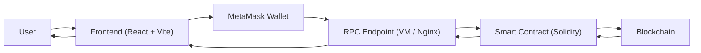

# 🌐 Blockchain Crowdfunding DApp

A decentralized and transparent crowdfunding platform built with **Solidity**, **React**, and **Hardhat**.  
This DApp allows users to create and contribute to fundraising campaigns directly on the blockchain — ensuring transparency, automation, and security.

---

# 📖 Overview

This project was developed as part of a **BSc Computing Final Year Project at Dorset College**.

The goal of the project is to demonstrate how **blockchain technology and smart contracts** can improve transparency and trust in crowdfunding platforms by removing reliance on centralized intermediaries.

The platform allows campaign creators to raise funds while ensuring that:

- contributions are recorded on-chain
- funds are only released if campaign goals are met
- contributors can automatically receive refunds when campaigns fail

---

# 🎯 Core Features

- Create and manage crowdfunding campaigns
- Contribute funds securely using connected wallets (MetaMask)
- Track campaign progress and raised amounts on-chain
- Automatic withdrawal for successful campaigns
- Automatic refunds for failed campaigns
- Admin moderation and campaign control
- Transparency through blockchain event logs

---

# 🧱 Architecture



This diagram illustrates the high-level architecture of the BlockFund platform.

The frontend interacts with the blockchain through a remote RPC endpoint hosted in a VM environment. Smart contracts handle all crowdfunding logic, while the blockchain ensures transparency and immutability of transactions. User interactions are performed through a browser interface connected via MetaMask.

---

# ⚙️ Technologies Used

| Layer | Technology | Description |
|------|-------------|-------------|
| Smart Contract | Solidity | Crowdfunding business logic |
| Development | Hardhat | Compile, test and deploy contracts |
| Security | OpenZeppelin | Access control and security utilities |
| Frontend | React + Vite | Web interface |
| Blockchain Interaction | Wagmi + Viem + RainbowKit | Wallet connections |
| DevOps | Docker + Jenkins | Environment and CI/CD automation |

---

## ⚠️ Important Note on Running the Project

This project uses a VM-hosted blockchain environment for smart contract execution.

As a result, running the frontend locally using only:

```bash
npm install
npm run dev
```

may not fully work unless the smart contract deployment and bundle are correctly configured.

### Recommended Evaluation Method

The recommended way to evaluate the project is:

1. Use the live deployed frontend

2. Review the source code and tests in this repository

3. (Optional) Follow the full deployment workflow described in this README

### Why this is required

The frontend depends on:

- a deployed smart contract
- a running RPC endpoint
- a synchronized deployment bundle (ABI + contract address)

If these components are not aligned, contract interactions may fail.

This design reflects a realistic deployment scenario where smart contract infrastructure is hosted separately from the client application.

## 🚀 Running the Project

This project relies on a VM-hosted blockchain environment for contract deployment, while the frontend is typically run locally on the host machine.

### Option A – Standard project workflow (VM + local frontend)

#### 1. Connect to the VM

SSH into the VM where the blockchain environment is hosted.

#### 2. Check Nginx

```bash
sudo nginx -t
sudo systemctl restart nginx
```

#### 3. Restart the Hardhat process

```bash
pm2 list
pm2 restart hardhat --update-env
pm2 logs hardhat --lines 30
```

#### 4. Recompile and redeploy the smart contract in the VM

```bash
cd ~/blockfund/dapp-crowdfunding/smart-contract
npx hardhat compile
npx hardhat ignition deploy ignition/modules/CrowdfundModule.cjs --network localhost --reset
```

#### 5. Generate the frontend deployment bundle

```bash
node scripts/export-frontend.cjs
```

#### 6. Copy the updated bundle to the local frontend project

Example command used on Windows PowerShell:

```bash
scp -i C:\Users\luanb\BlockFund\blockfund-key.pem ubuntu@13.53.105.108:/home/ubuntu/blockfund/dapp-crowdfunding/frontend/src/lib/crowdfund.bundle.json .\frontend\src\lib\crowdfund.bundle.json
```

#### 7. Start the frontend locally

```bash
cd frontend
npm install
npm run dev
```

The frontend will usually start at:

```text
http://localhost:5173
```

If that port is already in use, Vite may automatically switch to another port such as `5174`.

#### 8. Optional: update the deployed frontend

After copying the new bundle, commit and push the updated file so that Vercel uses the latest contract deployment.

```bash
git add frontend/src/lib/crowdfund.bundle.json
git add .
git commit -m "chore: update crowdfund bundle after VM redeploy"
git push
```
---

## 🦊 MetaMask Setup

To interact with the application, MetaMask is required.

Depending on the environment:

- For local testing: use Hardhat Local network (Chain ID 31337)
- For live demo: no manual setup is required if using the deployed frontend

Note: the live application connects to a remote RPC endpoint configured in the frontend.

---

## 🌍 Live Demo

A deployed version of the application is available at:

https://blockfund-frontend-six.vercel.app

This allows evaluators to explore the interface without installing the project locally.

---

## 🧪 Testing

Run smart contract tests:

```bash
cd smart-contract
npx hardhat test
```

Generate coverage reports:

```bash
npx hardhat coverage
```

---

## 📌 Notes for Evaluators

This repository contains the complete source code of the BlockFund project including:

- Solidity smart contracts
- React frontend application
- automated testing scripts
- CI/CD configuration

The system can be evaluated by:

1. Running the project locally using the instructions above
2. Reviewing the smart contract code and automated tests
3. Accessing the deployed frontend demo

---

## 👨‍💻 Author

Luan Bernardes Paes  
BSc Computing – Dorset College
